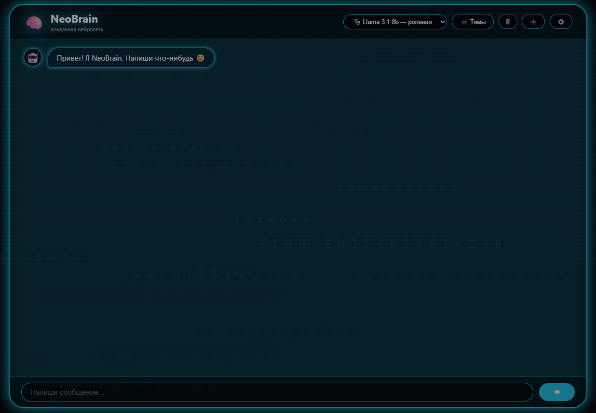
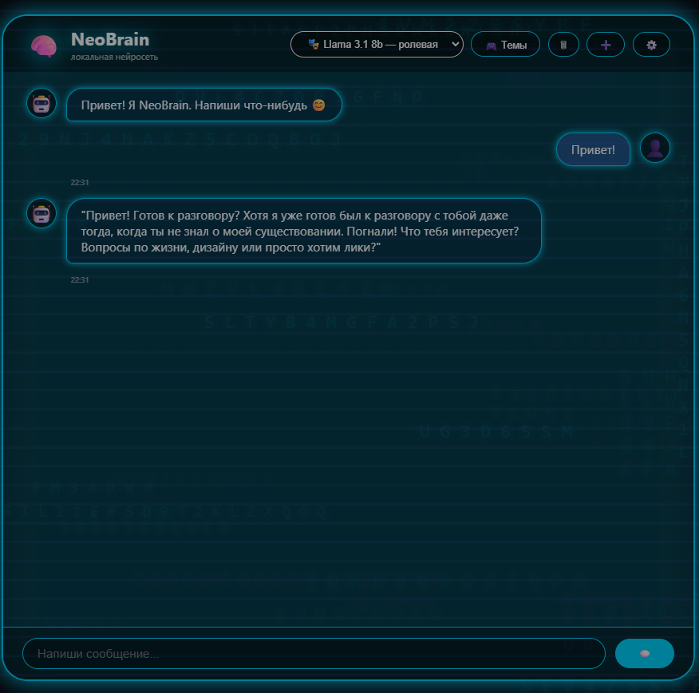

# 🧠 NeoBrain — локальный аналог Character.AI

[]()
[]()
[]()
[]()
[]()

**NeoBrain** — это веб-приложение для общения с ИИ-персонажами.  
Работает локально через Ollama, **без VPN, регистрации и слежки**.

---

## ✨ Возможности

- 🤖 **Локальная нейросеть** (Ollama)
- 🎭 **Ролевые персонажи** (создавай своих)
- 🎨 **7 цветовых тем** (Неон, Baby-doll, Летняя, Пляжная, Цифровая, Творческая, Тёплая)
- 🌡️ **Температура 1–10** (от чётких до креативных ответов)
- 📋 **Копирование ответов** одной кнопкой
- 💾 **История диалогов** в браузере
- 🧠 **Потоковый ответ** (печатает как ChatGPT)
- 💖 **Поддержка проекта** (ВТБ)

---

## 🖼️ Скриншоты

| Главный экран | Диалог с ИИ | Панель персонажей |
|--------------|-------------|-------------------|
|  |  |  |

> 📌 Скриншоты нужно добавить в папку `screenshots/` и загрузить на GitHub.

---

## 🚀 Быстрый старт

### 1. Установи [Ollama](https://ollama.com/) и скачай модель:

```bash
ollama pull qwen2.5-coder:7b
